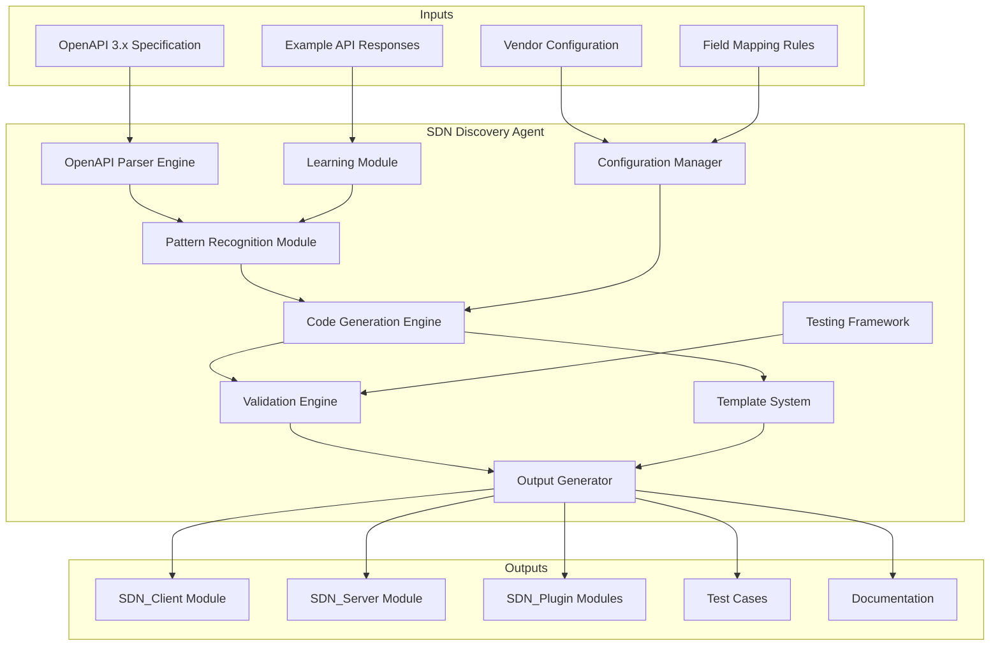

# SDN Discovery Agent - High-Level Design Document

## Executive Summary

This document outlines the design for an intelligent agent that automates the creation of SDN vendor implementations from OpenAPI specifications. The agent will analyze existing patterns from 6 implemented SDN vendors and generate complete, production-ready code following established NetMRI SDN architecture patterns.

## Current SDN Implementation Analysis

### Implemented SDN Vendors

| Vendor | Technology | Authentication | Key Features |
|--------|------------|---------------|--------------|
| **Cisco ACI** | Data Center Fabric | Cookie-based session | Multi-controller failover, Complex hierarchy (Tenant→BD→EPG) |
| **Cisco Meraki** | Cloud-managed networking | API Key (X-Cisco-Meraki-API-Key) | Organization→Network→Device model, Role-based collection |
| **Cisco Viptela** | SD-WAN | Cookie-based session | Session management, Device-centric data model |
| **Juniper Mist** | Cloud-managed Wi-Fi/LAN | Bearer Token | Org→Site→Device, Edge device support |
| **SilverPeak** | SD-WAN | API Token (X-Auth-Token) | Appliance-centric, CLI command execution |

### Architecture Patterns Identified

#### 1. **Three-Layer Architecture**
```
┌─────────────────┐    ┌─────────────────┐    ┌─────────────────┐
│   SDN_Client    │    │   SDN_Server    │    │  SDN_Plugins    │
│   (API Layer)   │───▶│ (Logic Layer)   │───▶│ (Data Layer)    │
└─────────────────┘    └─────────────────┘    └─────────────────┘
     Perl modules         Business logic       Database schema
     HTTP wrappers        Data transformation   Persistence
     Authentication       Error handling       Validation
```

#### 2. **Data Collection Categories**
- **Device Discovery**: Find all manageable devices
- **System Information**: Basic device details (Model, Serial, Version)
- **Interface/Port Data**: Physical and logical interfaces
- **Network Topology**: LLDP/CDP neighbor discovery
- **Routing Information**: Static/dynamic routes
- **Wireless Configuration**: SSIDs, radio status (for wireless vendors)
- **Status/Monitoring**: Operational state, performance metrics

#### 3. **Common Data Model**
All vendors map to standardized NetMRI fields:
```perl
# Standard device representation
{
    SdnControllerId => $fabric_id,
    SdnDeviceDN => $unique_device_identifier,
    Name => $device_name,
    NodeRole => $device_role,
    Vendor => $vendor_name,
    Model => $device_model,
    Serial => $serial_number,
    SWVersion => $software_version,
    IPAddress => $management_ip,
    modTS => $modification_timestamp
}
```

#### 4. **Authentication Patterns**
- **API Key**: Simple header-based (Meraki, SilverPeak, Mist)
- **Session-based**: Login→Cookie→Operations→Logout (ACI, Viptela)
- **Token-based**: Bearer tokens with refresh capability

#### 5. **Error Handling & Resilience**
- Rate limiting (vendor-specific: 3-100 req/sec)
- Retry mechanisms for HTTP 429 (Too Many Requests)
- Controller failover (ACI multi-controller setup)
- Graceful degradation for offline devices

## Agent Architecture Design

### Core Components



### 1. OpenAPI Parser Engine

**Purpose**: Extract and categorize API endpoints from OpenAPI specifications

**Key Functions**:
- Parse OpenAPI 3.x schemas
- Identify authentication schemes
- Categorize endpoints by data type
- Extract request/response schemas
- Detect pagination patterns

**Algorithm**:
```python
def parse_openapi_spec(spec):
    endpoints = categorize_endpoints(spec.paths)
    auth_methods = extract_auth_schemes(spec.security)
    data_models = analyze_schemas(spec.components.schemas)
    
    return {
        'device_discovery': filter_endpoints(endpoints, 'device_discovery'),
        'system_info': filter_endpoints(endpoints, 'system_info'),
        'interfaces': filter_endpoints(endpoints, 'interfaces'),
        'topology': filter_endpoints(endpoints, 'topology'),
        'auth_method': determine_primary_auth(auth_methods),
        'pagination': detect_pagination_pattern(endpoints)
    }
```

### 2. Pattern Recognition Module

**Purpose**: Map OpenAPI endpoints to NetMRI data collection patterns

**Classification Rules**:
```yaml
endpoint_classification:
  device_discovery:
    url_patterns: ["/devices", "/nodes", "/inventory", "/appliances"]
    methods: ["GET"]
    response_indicators: ["array", "list", "devices"]
    
  system_info:
    url_patterns: ["/devices/{id}", "/device/{serial}", "/appliance/{id}"]
    methods: ["GET"]
    path_parameters: ["id", "serial", "deviceId"]
    
  interfaces:
    url_patterns: ["/interfaces", "/ports", "/device/{id}/interfaces"]
    response_indicators: ["interfaces", "ports", "links"]
    
  topology:
    url_patterns: ["/topology", "/neighbors", "/lldp", "/cdp"]
    purpose: "network_discovery"
```

### 3. Code Generation Engine

**Purpose**: Generate production-ready Perl modules using templates

**Template Categories**:

#### A. SDN_Client Template
```perl
# Auto-generated template structure
package NetMRI::HTTP::Client::{{VENDOR_NAME}};

use strict;
use NetMRI::HTTP::Client::Generic;
use base 'NetMRI::HTTP::Client::Generic';

# Generated authentication setup
sub new {
    my $class = shift;
    my %args = @_;
    
    {{AUTH_VALIDATION}}
    {{BASE_URL_SETUP}}
    {{RATE_LIMITING_CONFIG}}
    
    return bless $self, $class;
}

{{GENERATED_API_METHODS}}
```

#### B. SDN_Server Template
```perl
package NetMRI::SDN::{{VENDOR_NAME}};

use strict;
use NetMRI::SDN::Base;
use base 'NetMRI::SDN::Base';

sub new {
    my $class = shift;
    my $self = $class->SUPER::new(@_);
    $self->{vendor_name} = '{{VENDOR_DISPLAY_NAME}}';
    return bless $self, $class;
}

sub obtainEverything {
    my $self = shift;
    {{DEVICE_TYPE_DETECTION}}
    {{DATA_COLLECTION_ORCHESTRATION}}
}

{{GENERATED_OBTAIN_METHODS}}
```

### 4. Intelligent API Selection

**Selection Algorithm**:
```perl
sub select_optimal_apis($openapi_data, $collection_type) {
    my @candidates = filter_by_data_type($openapi_data, $collection_type);
    
    # Priority scoring
    foreach my $api (@candidates) {
        $api->{score} = calculate_priority_score($api);
    }
    
    # Sort by score and select primary + fallback
    my @sorted = sort { $b->{score} <=> $a->{score} } @candidates;
    
    return {
        primary => $sorted[0],
        fallback => $sorted[1] // undef
    };
}

sub calculate_priority_score($api) {
    my $score = 0;
    
    # Prefer specific over generic endpoints
    $score += 10 if $api->{path} =~ /\{(device|id|serial)\}/;
    
    # Prefer GET over POST for data collection
    $score += 5 if $api->{method} eq 'GET';
    
    # Prefer APIs with detailed responses
    $score += 3 if $api->{response_schema_complexity} > 5;
    
    # Vendor-specific scoring
    $score += apply_vendor_specific_rules($api);
    
    return $score;
}
```

### 5. Data Transformation Engine

**Purpose**: Map vendor-specific API responses to NetMRI data models

**Transformation Patterns**:
```yaml
field_mappings:
  device_identification:
    netmri_field: "SdnDeviceDN"
    vendor_patterns:
      - "id"
      - "deviceId" 
      - "serial"
      - "uuid"
      - "dn"
      
  management_ip:
    netmri_field: "IPAddress"
    vendor_patterns:
      - "managementIp"
      - "ip"
      - "address"
      - "mgmtIp"
      - "lanIp"
      
  device_role:
    netmri_field: "NodeRole"
    transformation: "vendor_prefix + device_type"
    examples:
      - "{{VENDOR}} Switch"
      - "{{VENDOR}} Router"
      - "{{VENDOR}} Wireless"
```

### 6. Plugin Selection Engine

**Purpose**: Intelligently determine which NetMRI plugins to use for data persistence

**How It Works**: The agent analyzes OpenAPI response schemas and automatically maps them to the appropriate NetMRI `SaveXXX` plugins.

**Current Plugin Mechanism** (from existing SDN implementations):
- Uses Perl's `AUTOLOAD` magic method pattern
- Calling `$self->saveDevices($data)` → automatically routes to `SaveDevices` plugin
- 40+ available plugins for different data types (Devices, SystemInfo, Interfaces, CDP, LLDP, etc.)

**Agent's Intelligent Plugin Selection**:

#### A. Schema-Based Classification
```python
def determine_plugins_from_api(api_response_schema):
    plugins = []
    
    # Analyze field patterns in response
    if has_device_fields(api_response_schema):
        plugins.append('SaveDevices')
    
    if has_interface_fields(api_response_schema):
        plugins.append('SaveSdnFabricInterface')
    
    if has_neighbor_fields(api_response_schema):
        plugins.extend(['SaveCDP', 'SaveLLDP'])
    
    return plugins
```

#### B. Plugin Mapping Rules
```yaml
plugin_mapping_rules:
  device_discovery:
    response_patterns: ["devices", "nodes", "inventory"]
    required_fields: ["id", "name", "model", "serial"]
    maps_to: "SaveDevices"
    
  interfaces:
    response_patterns: ["interfaces", "ports"]
    required_fields: ["name", "mac", "status"]
    maps_to: "SaveSdnFabricInterface"
    
  neighbors:
    response_patterns: ["lldp", "cdp", "neighbors"]
    maps_to: ["SaveCDP", "SaveLLDP"]
```

#### C. Generated Plugin Registration
```perl
# Auto-generated in vendor's Server module
sub _register_vendor_plugins {
    my $self = shift;
    
    # Standard plugins (always used)
    $self->{autoload_save_methods}->{$_} = 1 
        foreach qw(Devices SystemInfo SdnFabricInterface);
    
    # Conditional plugins (based on API capabilities)
    $self->{autoload_save_methods}->{$_} = 1 
        foreach qw(CDP LLDP) if $self->_has_neighbor_api();
    
    $self->{autoload_save_methods}->{Wireless} = 1 
        if $self->_has_wireless_api();
}
```

#### D. Plugin Decision Tree
```
OpenAPI Analysis
    ↓
Identify Data Categories
    ↓
Match to NetMRI Plugins
    ↓
Generate Plugin Registration
    ↓
Create obtain* Methods
    ↓
Auto-route to Correct Plugin
```

**Plugin Compatibility Matrix**:

| API Response Type | Plugin | Usage |
|-------------------|--------|-------|
| Device list | `SaveDevices` | Required |
| System details | `SaveSystemInfo` | Required |
| Interfaces/Ports | `SaveSdnFabricInterface` | Required |
| CDP/LLDP neighbors | `SaveCDP`, `SaveLLDP` | Optional |
| Switch ports | `SaveSwitchPortObject` | Conditional* |
| VLANs | `SaveVlanObject` | Conditional* |
| Wireless data | `SaveWireless` | Conditional* |
| Routing table | `SaveipRouteTable` | Optional |
| Endpoints/Clients | `SaveSdnEndpoint` | Optional |

*Conditional = Based on device type/role detected from API

**Validation**: The agent validates plugin selection by:
- Checking response schema coverage (80% minimum field match)
- Verifying data transformations are valid
- Generating test cases with mock API responses

**See detailed plugin selection strategy in**: [`Plugin_Selection_Strategy.md`](Plugin_Selection_Strategy.md)

## Implementation Plan

### Phase 1: Foundation (Weeks 1-2)
1. **OpenAPI Parser Development**
   - Implement spec parsing logic
   - Create endpoint categorization engine
   - Build authentication method detection

2. **Pattern Analysis**
   - Deep analysis of existing 6 vendor implementations
   - Extract common patterns and templates
   - Document vendor-specific variations

### Phase 2: Core Engine (Weeks 3-4)
1. **Template System**
   - Create parameterized Perl templates
   - Implement variable substitution engine
   - Build conditional logic for vendor differences

2. **Code Generation Engine**
   - Develop code generation algorithms
   - Implement API selection logic
   - Create data transformation rules

### Phase 3: Intelligence Layer (Weeks 5-6)
1. **Pattern Recognition**
   - ML-based endpoint classification
   - Automatic field mapping detection
   - Vendor behavior pattern learning

2. **Validation Engine**
   - Generated code syntax validation
   - Logic flow verification
   - NetMRI integration testing

### Phase 4: Agent Interface (Weeks 7-8)
1. **User Interface**
   - CLI interface for agent operation
   - Web interface for configuration
   - Progress monitoring and reporting

2. **Configuration Management**
   - Vendor-specific customizations
   - Override mechanisms
   - Template versioning

## Key Benefits

### 1. **Development Acceleration**
- **Time Reduction**: 90% faster vendor integration (weeks → hours)
- **Consistency**: Standardized code quality across all vendors
- **Maintainability**: Template-driven updates for all vendors

### 2. **Quality Assurance**
- **Pattern Compliance**: Follows proven NetMRI SDN patterns
- **Error Reduction**: Eliminates manual coding errors
- **Best Practices**: Incorporates lessons learned from existing implementations

### 3. **Scalability**
- **Rapid Expansion**: Support new vendors with minimal effort
- **Version Management**: Easy updates for API changes
- **Knowledge Capture**: Preserves institutional knowledge in templates

### 4. **Risk Mitigation**
- **Tested Patterns**: Based on production-proven implementations
- **Validation Framework**: Comprehensive testing before deployment
- **Rollback Capability**: Safe deployment with fallback options

## Success Metrics

1. **Code Generation Quality**: 95%+ generated code passes validation
2. **Development Speed**: <4 hours from OpenAPI spec to working implementation
3. **Pattern Compliance**: 100% adherence to established SDN patterns
4. **Maintainability**: Single template update affects all vendors
5. **Test Coverage**: Auto-generated test cases achieve >90% coverage

## Technical Requirements

### Hardware Requirements
- **Development Environment**: Modern workstation with 16GB+ RAM
- **Testing Infrastructure**: Virtual lab environment for vendor simulators

### Software Dependencies
- **Perl 5.x**: Core runtime environment
- **OpenAPI Tools**: Swagger/OpenAPI 3.x parsing libraries
- **Template Engine**: Text::Template or similar
- **Version Control**: Git with branching strategy
- **CI/CD Pipeline**: Automated testing and deployment

### Integration Points
- **NetMRI Core**: Seamless integration with existing SDN framework
- **Database Schema**: Compatible with current plugin architecture
- **Authentication Systems**: Support for various auth mechanisms
- **Monitoring Systems**: Integration with NetMRI monitoring

## Risk Assessment & Mitigation

### Technical Risks
1. **OpenAPI Spec Variations**: Different vendors may have non-standard specs
   - *Mitigation*: Flexible parsing with vendor-specific adaptations

2. **Authentication Complexity**: Complex auth flows may be difficult to automate
   - *Mitigation*: Manual override mechanisms for complex cases

3. **API Rate Limiting**: Aggressive rate limiting may impact testing
   - *Mitigation*: Configurable rate limiting with vendor-specific settings

### Business Risks
1. **Vendor API Changes**: Breaking changes in vendor APIs
   - *Mitigation*: Version-aware generation with backward compatibility

2. **Maintenance Overhead**: Agent itself requires ongoing maintenance
   - *Mitigation*: Comprehensive documentation and knowledge transfer

## Conclusion

The SDN Discovery Agent represents a significant advancement in NetMRI's SDN capabilities. By automating the creation of vendor implementations from OpenAPI specifications, we can dramatically accelerate the integration of new SDN vendors while maintaining the high quality and consistency of our existing implementations.

The agent leverages proven patterns from our current 6 vendor implementations, ensuring that generated code follows established best practices and integrates seamlessly with the NetMRI platform. This approach positions NetMRI to rapidly expand SDN vendor support in response to market demands while reducing development costs and risks.

---

*Document Version: 1.0*  
*Last Updated: November 4, 2025*  
*Author: SDN Development Team*
